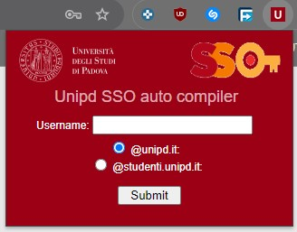

# UniPD-SSO-autocompiler
A chrome extension to auto fill SSO mail and role

Simply fill the email field and select the desired role.
Once saved the next SSO page reload will auto fill login form.
(Password is not managed due to security risk, use a password manager instead)

